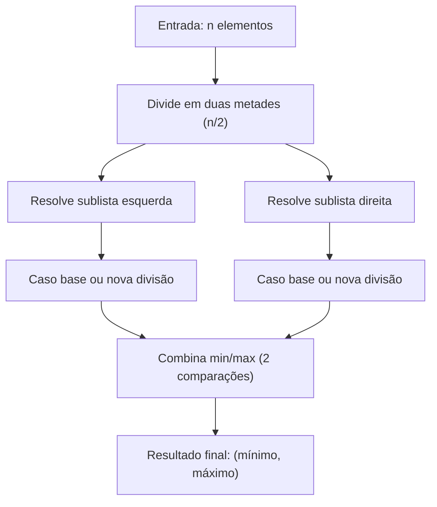

# Projeto MaxMin Select

O **MaxMin Select** é um projeto desenvolvido para implementar e analisar o algoritmo de **seleção simultânea do maior e do menor elemento** de uma sequência numérica, utilizando a técnica de **divisão e conquista**.  

Este projeto foi desenvolvido como parte da disciplina **Fundamentos de Projeto e Análise de Algoritmos**.

---

## Conceito do Algoritmo

O algoritmo **MaxMin Select** tem como objetivo encontrar, de forma eficiente, o **menor** e o **maior** elemento de uma lista de números.  

- A abordagem **ingênua** realiza `2n - 2` comparações para uma lista de tamanho `n`.  
- Já o **MaxMin Select**, usando divisão e conquista, reduz esse número para aproximadamente **3n/2 - 2** comparações, mantendo complexidade linear.

---

## Notação Big O

A análise assintótica mostra que o **MaxMin Select** pertence à classe de complexidade **O(n)**.  

- **O(1)**: Constante → operações independentes do tamanho da entrada.  
- **O(log n)**: Logarítmica → cresce lentamente mesmo com entradas grandes.  
- **O(n)**: Linear → operações aumentam proporcionalmente ao tamanho da entrada.  
- **O(n²)**: Quadrática → cresce rapidamente e se torna impraticável para n grandes.  

O **MaxMin Select** é um exemplo de algoritmo **linear O(n)**, o que o torna eficiente e escalável.

---

## Complexidade Assintótica

### Por Contagem de Operações
- Divide a lista em duas metades.  
- Resolve recursivamente cada metade.  
- Combina os resultados em **2 comparações adicionais** (mínimo e máximo).  

**Total de comparações:**  
```
3n/2 - 2
```

**Complexidade final:**  
```
O(n)
```

---

### Pelo Teorema Mestre
A recorrência do algoritmo é:  

```
T(n) = 2T(n/2) + O(1)
```

- **a = 2**, **b = 2**, **f(n) = O(1)**  
- `log_b a = log_2 2 = 1`  
- Como `f(n) = O(1) = O(n^(p-ε))`, estamos no **Caso 1** do Teorema Mestre.  

**Solução assintótica:**  
```
T(n) = Θ(n)
```

---

## Dependências

Este projeto não possui dependências externas. Basta utilizar **Python 3.8+**.

---

## Ambiente Virtual

### Passo 1: Criar e ativar
```bash
python -m venv .venv
```
- **Linux/Mac:**  
  ```bash
  source .venv/bin/activate
  ```
- **Windows:**  
  ```bash
  .venv\Scripts\activate
  ```

### Passo 2: Executar
```bash
python main.py 7 -3 9 2 11 5 -10 4
```

Saída esperada:
```text
Input: [7, -3, 9, 2, 11, 5, -10, 4]
Minimum: -10
Maximum: 11
Comparisons: 10
```

---

## Estrutura do Projeto

- **main.py** → implementação do algoritmo MaxMin Select.  
- **test_maxmin.py** → testes unitários com vários cenários.  
- **README.md** → documentação, análise de complexidade e instruções de uso.  

---

## Explicação das Funções

### Arquivo: `main.py`

#### `maxmin_select(seq)`
- **Objetivo:** encontra o menor e maior elemento em `seq` com menos comparações.  
- **Parâmetros:**  
  - `seq`: sequência de inteiros.  
- **Retorno:** objeto com `minimum`, `maximum` e `comparisons`.  

**Casos base:**  
- Lista de 1 elemento → 0 comparações.  
- Lista de 2 elementos → 1 comparação.  

**Etapa de combinação:**  
- Compara os mínimos das duas metades.  
- Compara os máximos das duas metades.  
- Soma as comparações realizadas.

---

## 📈 Diagrama da Recursão (Mermaid)



---

## Saída da Execução

Exemplo:
```text
Input: [3, 1, 4, 1, 5, 9]
Minimum: 1
Maximum: 9
Comparisons: 7
```

---

## Documentação e Links Úteis

- [Aula 01 – Análise de Complexidade de Algoritmos](https://github.com/joaopauloaramuni/fundamentos-de-projeto-e-analise-de-algoritmos/tree/main/PDF)  
- Cormen, T. H. *Algoritmos: Teoria e Prática*. 3ª ed. LTC, 2012.  
- Ziviani, N. *Projeto de Algoritmos*. Cengage Learning, 2007.  

---
