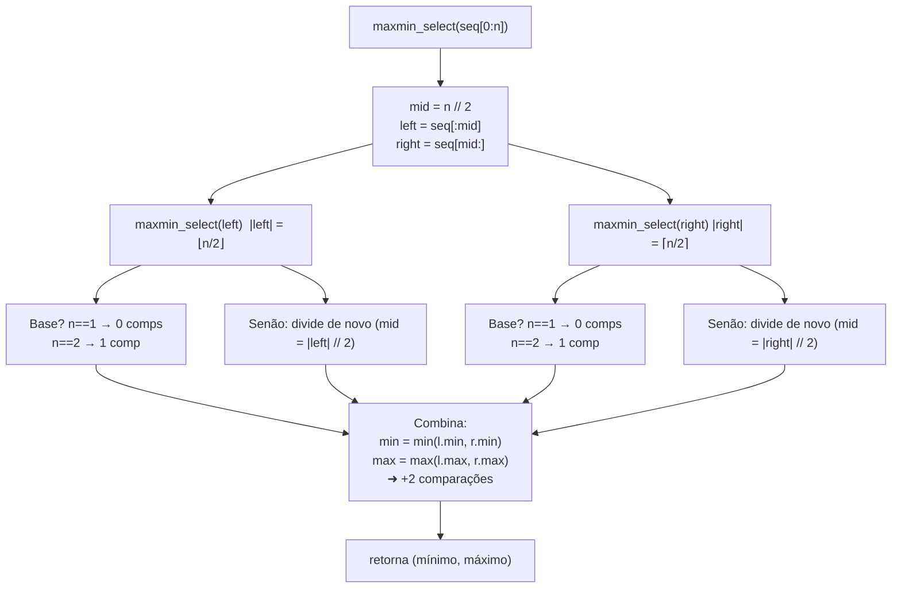
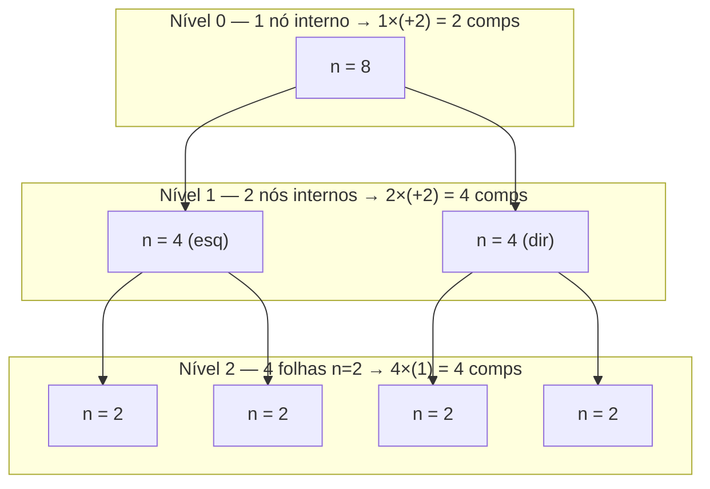

# Projeto MaxMinSelect

O **MaxMinSelect** é um projeto desenvolvido para aplicar conceitos de **Análise de Complexidade de Algoritmos**, especificamente com foco em algoritmos **recursivos de divisão e conquista**. O objetivo é encontrar o **mínimo e o máximo** de uma sequência numérica utilizando a abordagem de **recursividade binária**.

## Estrutura do Projeto

- `main.py`  
  Implementa o algoritmo recursivo `maxmin_select`.
- `test_main.py`  
  Contém os testes unitários (`unittest`) para validar o comportamento do algoritmo.
- `README.md`  
  Documentação do projeto, incluindo explicações sobre a complexidade assintótica e diagramas da execução recursiva.

---

## Conceitos Fundamentais

Segundo o material da disciplina **Fundamentos de Projeto e Análise de Algoritmos**:

- **Medição de tempo**: avalia o desempenho do algoritmo em diferentes entradas.  
- **Complexidade assintótica**: analisa o comportamento do algoritmo quando o tamanho da entrada cresce.  
- **Notação Big-O**: representa o pior caso do algoritmo.  
- **Recursividade binária**: estratégia de dividir para conquistar, em que uma função se chama duas vezes em cada etapa (como no MergeSort, QuickSort e MaxMin Select).  

---

## Algoritmo MaxMin Select

### Descrição
O algoritmo divide a lista em duas metades, resolve recursivamente cada metade e depois combina os resultados, comparando os mínimos e máximos parciais.  

- Caso base:  
  - `n = 1` → 0 comparações  
  - `n = 2` → 1 comparação  
- Passo recursivo:  
  - Divide a sequência em `left = seq[:mid]` e `right = seq[mid:]`  
  - Combina resultados com **2 comparações adicionais** (`min` e `max`)

### Complexidade
- Número de comparações: aproximadamente `3n/2 - 2`.  
- Complexidade assintótica: **O(n)**  

---

## Diagramas da Recursão

### Fluxo fiel ao código


### Árvore de recursão (exemplo n = 8)

**Total (n=8):** 4 (folhas) + 4 (nível 1) + 2 (nível 0) = **10 comps** = `3n/2 - 2`.

---

## Dependências

Este projeto não utiliza bibliotecas externas além da biblioteca padrão do Python.

- Python ≥ 3.10

---

## Como executar

### Executar o algoritmo diretamente
```bash
python main.py 7 -3 9 2 11 5 -10 4
```

### Rodar os testes
```bash
python -m unittest test_main.py
```

---

## Referências

- Prof. Dr. João Paulo Aramuni — Fundamentos de Projeto e Análise de Algoritmos  
- Cormen, Leiserson, Rivest, Stein. **Algoritmos: Teoria e Prática**.  
- Nivio Ziviani. **Projeto de Algoritmos: com implementações em Java e C++**.  

---
