# Projeto MaxMinSelect

O **MaxMinSelect** é um projeto desenvolvido para aplicar conceitos de **Análise de Complexidade de Algoritmos**, especificamente com foco em algoritmos **recursivos de divisão e conquista**. O objetivo é encontrar o **mínimo e o máximo** de uma sequência numérica utilizando a abordagem de **recursividade binária**.

## Estrutura do Projeto

- `main.py`  
  Implementa o algoritmo recursivo `maxmin_select`.
- `test_main.py`  
  Contém os testes unitários (`unittest`) para validar o comportamento do algoritmo.
- `README.md`  
  Documentação do projeto, incluindo explicações sobre a complexidade assintótica e diagramas da execução recursiva.

---

## Conceitos Fundamentais

Segundo o material da disciplina **Fundamentos de Projeto e Análise de Algoritmos**:

- **Medição de tempo**: avalia o desempenho do algoritmo em diferentes entradas.  
- **Complexidade assintótica**: analisa o comportamento do algoritmo quando o tamanho da entrada cresce.  
- **Notação Big-O**: representa o pior caso do algoritmo.  
- **Recursividade binária**: estratégia de dividir para conquistar, em que uma função se chama duas vezes em cada etapa (como no MergeSort, QuickSort e MaxMin Select).  

---

## Algoritmo MaxMin Select

### Descrição
O algoritmo divide a lista em duas metades, resolve recursivamente cada metade e depois combina os resultados, comparando os mínimos e máximos parciais.  

- Caso base:  
  - `n = 1` → 0 comparações  
  - `n = 2` → 1 comparação  
- Passo recursivo:  
  - Divide a sequência em `left = seq[:mid]` e `right = seq[mid:]`  
  - Combina resultados com **2 comparações adicionais** (`min` e `max`)

### Complexidade
- Número de comparações: aproximadamente `3n/2 - 2`.  
- Complexidade assintótica: **O(n)**  

---

## Explicação Linha a Linha (`main.py`)

```python
from __future__ import annotations
from dataclasses import dataclass
from typing import Sequence
```
🔹 Importações necessárias para usar **tipagem estática** e o decorador `@dataclass`.

```python
@dataclass
class MaxMinResult:
    minimum: int
    maximum: int
    comparisons: int
```
🔹 Define uma classe simples para armazenar o resultado: menor valor, maior valor e número de comparações feitas.

```python
def maxmin_select(seq: Sequence[int]) -> MaxMinResult:
    n = len(seq)
```
🔹 Função principal que recebe a sequência `seq`. A variável `n` guarda o tamanho da lista.

```python
    if n == 0:
        raise ValueError("Empty sequence.")
```
🔹 Caso base: se a lista for vazia, lança um erro, pois não há mínimo/máximo.

```python
    if n == 1:
        return MaxMinResult(seq[0], seq[0], 0)
```
🔹 Caso base: lista de 1 elemento → mínimo e máximo são iguais, e nenhuma comparação é feita.

```python
    if n == 2:
        if seq[0] <= seq[1]:
            return MaxMinResult(seq[0], seq[1], 1)
        else:
            return MaxMinResult(seq[1], seq[0], 1)
```
🔹 Caso base: lista de 2 elementos → faz apenas **1 comparação** para decidir o mínimo e o máximo.

```python
    mid = n // 2
    left = maxmin_select(seq[:mid])
    right = maxmin_select(seq[mid:])
```
🔹 Passo recursivo: divide a lista em duas metades (`seq[:mid]` e `seq[mid:]`), e chama recursivamente a função para cada lado.

```python
    comparisons = left.comparisons + right.comparisons
```
🔹 Soma o número de comparações feitas em cada metade.

```python
    if left.minimum <= right.minimum:
        global_min = left.minimum
        comparisons += 1
    else:
        global_min = right.minimum
        comparisons += 1
```
🔹 Compara os **mínimos** de cada metade (1 comparação) e guarda o menor valor global.

```python
    if left.maximum >= right.maximum:
        global_max = left.maximum
        comparisons += 1
    else:
        global_max = right.maximum
        comparisons += 1
```
🔹 Compara os **máximos** de cada metade (1 comparação) e guarda o maior valor global.

```python
    return MaxMinResult(global_min, global_max, comparisons)
```
🔹 Retorna o resultado contendo o mínimo, o máximo e o total acumulado de comparações.

```python
if __name__ == "__main__":
    import sys
    data = [int(x) for x in sys.argv[1:]] if len(sys.argv) > 1 else [7, -3, 9, 2, 11, 5, -10, 4]
    print("Input:", data)
    result = maxmin_select(data)
    print("Minimum:", result.minimum)
    print("Maximum:", result.maximum)
    print("Comparisons:", result.comparisons)
```
🔹 Se o arquivo for executado diretamente, ele:  
1. Lê os números passados na linha de comando ou usa uma lista padrão.  
2. Chama `maxmin_select`.  
3. Imprime os resultados no terminal.

---

## Diagramas da Recursão

### Fluxo fiel ao código

```mermaid
flowchart TD
    A["maxmin_select(seq[0:n])"] --> B["mid = n // 2
left = seq[:mid]
right = seq[mid:]"]
    B --> C["maxmin_select(left)  |left| = ⌊n/2⌋"]
    B --> D["maxmin_select(right) |right| = ⌈n/2⌉"]

    %% esquerda
    C --> Cb["Base?  n==1 → 0 comps
n==2 → 1 comp"]
    C --> Crec["Senão: divide de novo (mid = |left| // 2)"]

    %% direita
    D --> Db["Base?  n==1 → 0 comps
n==2 → 1 comp"]
    D --> Drec["Senão: divide de novo (mid = |right| // 2)"]

    Cb --> E["Combina:
min = min(l.min, r.min)
max = max(l.max, r.max)
➜ +2 comparações"]
    Db --> E
    Crec --> E
    Drec --> E
    E --> F["retorna (mínimo, máximo)"]
```


### Árvore de recursão (exemplo n = 8)

```mermaid
graph TD
    subgraph L0["Nível 0 — 1 nó interno → 1×(+2) = 2 comps"]
    A0["n = 8"]
    end

    subgraph L1["Nível 1 — 2 nós internos → 2×(+2) = 4 comps"]
    A1L["n = 4 (esq)"]
    A1R["n = 4 (dir)"]
    end

    subgraph L2["Nível 2 — 4 folhas n=2 → 4×(1) = 4 comps"]
    A2LL["n = 2"]
    A2LR["n = 2"]
    A2RL["n = 2"]
    A2RR["n = 2"]
    end

    A0 --> A1L
    A0 --> A1R
    A1L --> A2LL
    A1L --> A2LR
    A1R --> A2RL
    A1R --> A2RR
```

**Total (n=8):** 4 (folhas) + 4 (nível 1) + 2 (nível 0) = **10 comps** = `3n/2 - 2`.

---

## Dependências

Este projeto não utiliza bibliotecas externas além da biblioteca padrão do Python.

- Python ≥ 3.10

---

## Como executar

### Executar o algoritmo diretamente
```bash
python main.py 7 -3 9 2 11 5 -10 4
```

### Rodar os testes
```bash
python -m unittest test_main.py
```

---

## Referências

- Prof. Dr. João Paulo Aramuni — Fundamentos de Projeto e Análise de Algoritmos  
- Cormen, Leiserson, Rivest, Stein. **Algoritmos: Teoria e Prática**.  
- Nivio Ziviani. **Projeto de Algoritmos: com implementações em Java e C++**.  

---
